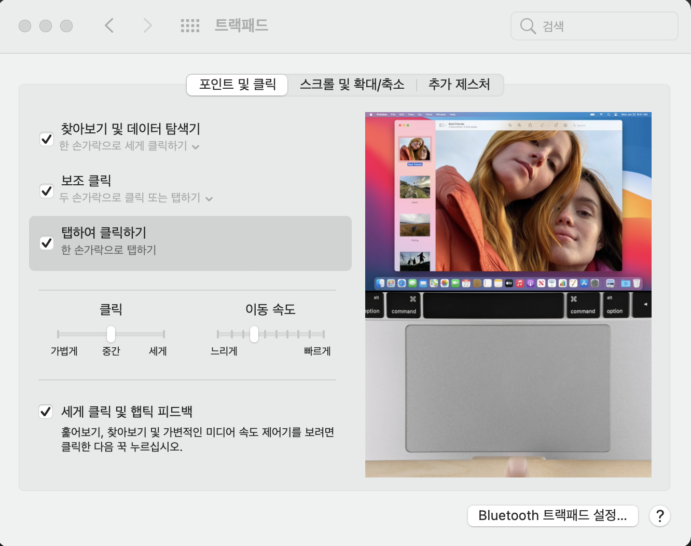
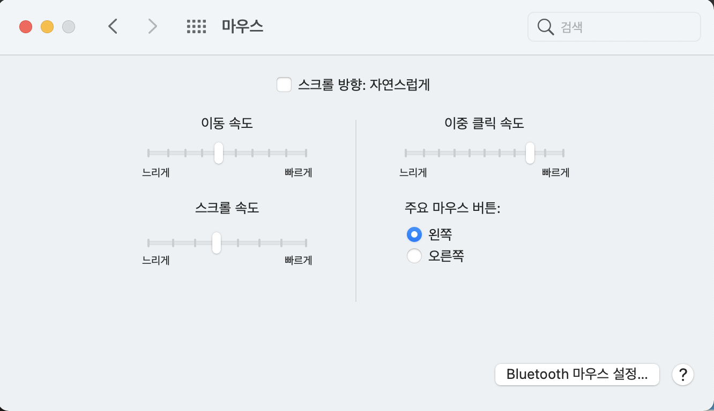
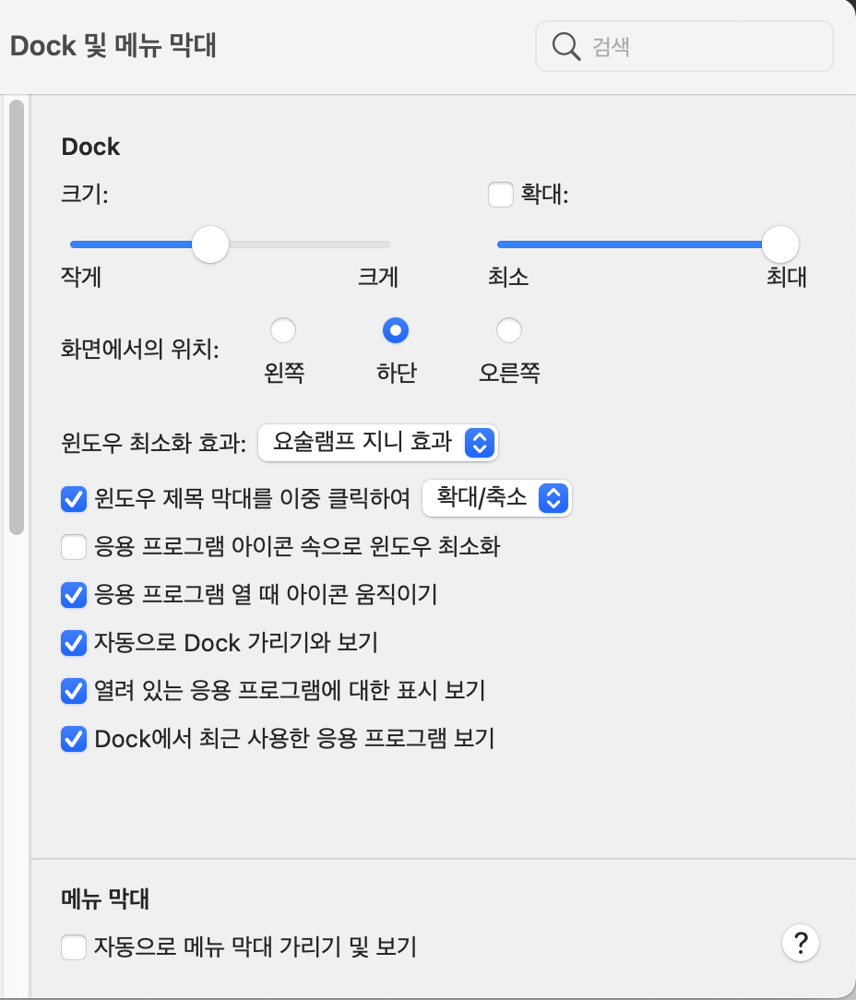

# 나의 맥 꿀팁

소소하지만 유용한 맥 꿀팁입니다.

 
 

## 1.트랙패드 클릭

 

맥을 처음 사용했을 때 터치패드를 가볍게 터치하면 클릭이 되는 다른 노트북과 다르게 맥은 트랙패드를 눌러야 클릭이 되어서 불편했었습니다. 탭클릭을 위해 다음과 같이 설정합니다.

 

시스템 환결성정 -> 트랙패드 -> 탭하여 클릭하기

 

 
 

## 2. 마우스 설정

맥은 휠 방향이 반대입니다. 마우스를 연결했을 때 휠업을하면 화면아 아래로 내려가고, 휠다운을하면 화면이 위로 올라갑니다. 휠 방향과 화면 방향을 맞춰주기 위해서 다음과 같은 설정을 합니다.

 

시스템설정 -> 마우스 -> 스크롤 방향: 자연스럽게 해제

 

 
 

## 3. DocK 숨기기

Dock이 하단 화면의 공간을 계속 차지하고 있기 때문에 숨겨두고 필요할 때만 보이게 설정합니다.

 

시스템설정 -> Dock 및 메뉴 막대 -> 자동으로 Dock 가리기와 보기

 

