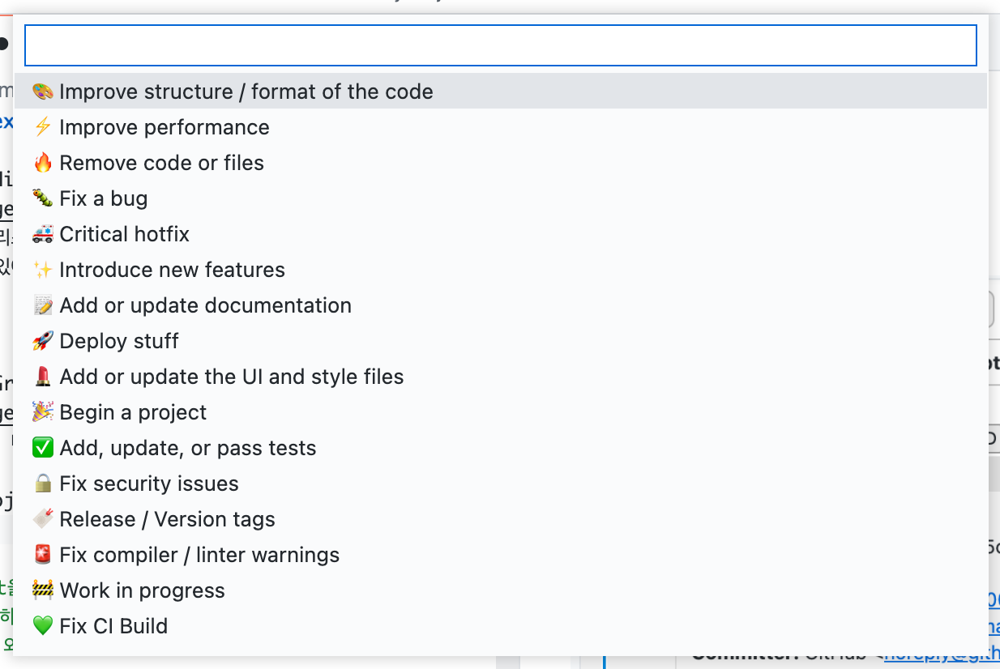

# Vscode Extensions Tip

##1. Git History

> 커밋 내용을 리스트 형식으로 확인할 수 있고 GUI 형식으로 커밋 리셋을 제공하기 때문에 편리합니다.

##2. Gitmoji

> 커밋 메세지에 사용할 이모지를 제공합니다. 약속된 표현을 뜻하는 이모지를 활용하면 이해하기 쉽고 단순하고 효과적으로 커밋 메세지를 표현하는데 도움이 됩니다.

##3. GitLens

> GitLens는 소규모보다는 대규모 팀에서, 단기보다는 장기 프로젝트에서 더 유용하지만 쉽게 코드의 변천사를 확인할 수 있기 때문에 소개해드립니다.

##4. etc.

> - GitHub Pull Requests and Issues - 웹사이트에서 할 일을 vscode 내에서 가능하게 함
> - Git Graph - Git History와 비슷한 extension
> - GitHub Theme - 제가 가장 좋아하는 vscode theme

##Conclusion

> > 앞으로 협력하는데 있어서 git이 많이 사용될 것이기 때문에 vscode extension을 활용하면 생산성 향상에 많은 도움이 되고 제가 소개해드린 것 외에도 유익한 extension이 많으니 잘 찾아보시고 활용하시길 바랍니다! 😄
